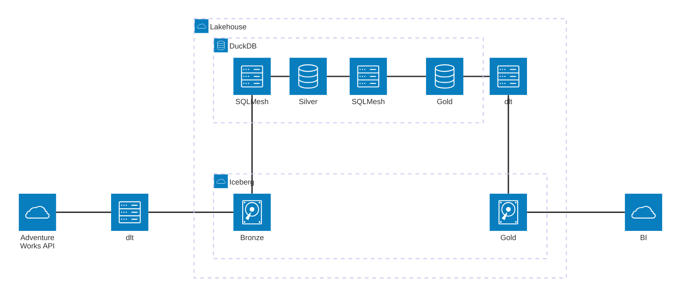

# Serverless Lakehouse

## Architecture

```mermaid
architecture-beta
    service api(cloud)[Adventure Works API]
    service extract(server)[dlt]

    group lakehouse(cloud)[Lakehouse]
        group engine(database)[DuckDB] in lakehouse
            service staging(server)[SQLMesh] in engine
            service silver(database)[Silver] in engine
            service transform(server)[SQLMesh] in engine
            service gold(database)[Gold] in engine

        group s3(cloud)[Iceberg] in lakehouse
            service bronze(disk)[Bronze] in s3
            service gold_export(disk)[Gold] in s3
    
        service export(server)[dlt] in lakehouse
        
    service consumption(cloud)[BI]

    api:R -- L:extract
    extract:R -- L:bronze
    bronze:T -- B:staging
    staging:R -- L:silver
    silver:R -- L:transform
    transform:R -- L:gold
    gold:R -- L:export
    export:B -- T:gold_export
    gold_export:R -- L:consumption
```