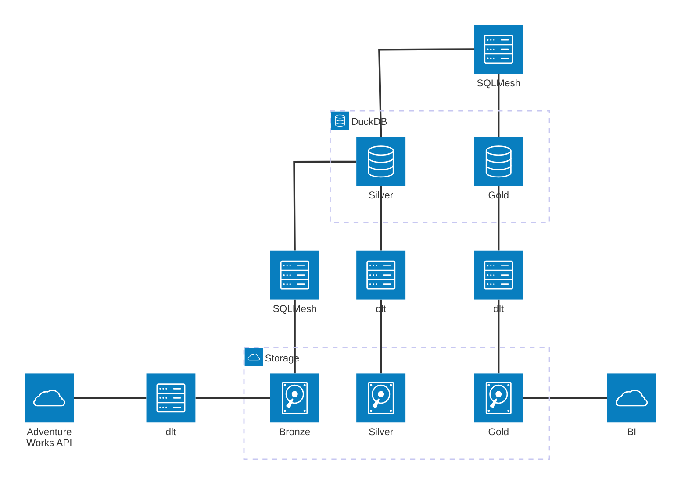

# Serverless Lakehouse

## Architecture

```mermaid
architecture-beta
    service api(cloud)[Adventure Works API]
    service extract(server)[dlt]
    service load(server)[SQLMesh]
    service transform(server)[SQLMesh]
    service export_silver(server)[dlt]
    service export_gold(server)[dlt]
    service consumption(cloud)[BI]

    group storage(cloud)[Storage]
        service bronze(disk)[Bronze] in storage
        service silver(disk)[Silver] in storage
        service gold(disk)[Gold] in storage

    group engine(database)[DuckDB]
        service silver_view(database)[Silver] in engine
        service gold_view(database)[Gold] in engine

    api:R -- L:extract
    extract:R -- L:bronze
    bronze:T -- B:load
    load:T -- L:silver_view
    silver_view:T -- L:transform
    transform:B -- T:gold_view
    silver_view:B -- T:export_silver
    export_silver:B -- T:silver
    gold_view:B -- T:export_gold
    export_gold:B -- T:gold
    gold:R -- L:consumption
```